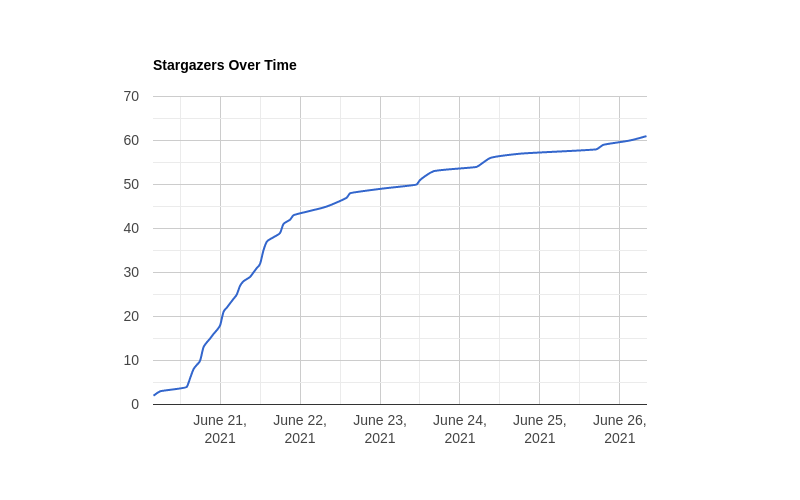

# Planetarium - GitHub Stargazers rendered in Google Charts

Planetarium is a slightly eccentric implementation that allows you to generate a PNG chart of a repository's Stargazers
over time.



## Prequisites

Python 3 with pip
[Docker](https://docs.docker.com/get-docker/) \
[Steampipe](https://steampipe.io/) with [GitHub plugin](https://hub.steampipe.io/plugins/turbot/github)\
[GitHub Access Token](https://github.com/settings/tokens)

## Instructions

Create a GitHub access token with the following scopes:

- repo (all)
- read:org
- read:user
- gist
- user:email

The user must have access to the desired repository. 

Install Python requirements:

`pip install -r requirements.txt`

Install Steampipe ([Multi-platform installation guide](https://steampipe.io/downloads))

Install GitHub plugin with: \
`steampipe plugin install github`

Edit `~/.steampipe/config/github.spc` to include GitHub token:

```
connection "github" {
  plugin = "github"
  token  = "111222333444555666777888999aaabbbcccddde"
}
```
Clone the repository. Run the query script with the full `orgname/repo` that you want to generate Stargazers for:

`./query.sh TechToSpeech/terraform-aws-serverless-static-wordpress`

This will need to pull the selenium/standalone-chrome container which is reasonably large (~450mb). A couple of python 
scripts then run and download the generated chart as `stargazers.png` to the directory where the script was run. 

That's it!

## How it Works

This is termed an 'eccentric' implementation because Google Charts has no external API and the chart must be generated
via Javascript in an HTML page. Most browsers will not allow a local html `file://` to embed a local Javascript file, 
(it throws CORS errors) so this must be accessed over a 'real' HTTP server. Here we've customised an extremely minimal 
Python implementation that runs for precisely _three_ requests that are necessary to generate the chart, and then closes. 
Selenium is required to emulate the user activity to automatically download the chart to the local machine using 
Javascript prompts. 

The chart requires data source for the chart data. Here we're using a CSV file imported using 
[jquery.csv.js](https://github.com/evanplaice/jquery-csv) where the data is loaded from a local file. See 
[data.csv](data.csv) for an example of expected format. 

That file is populated by Steampipe's amazing ability to query the GitHub API as simple SQL: We've written an
appropriate query to aggregate your repository's Stargazers by hour, so as to create the nice smooth graph that takes
into account hours within the day, and not just the daily total.

This result is piped out as a local file which is then ingested by the HTML/Javascript that generates the chart. 

## Customise the Chart

As the chart uses Google Charts, you can check out 
[their documentation](https://developers.google.com/chart/interactive/docs) on how to customier the chart to your 
liking. The default here is a curved line chart which is nice and smooth, but it could be bar chart, or any other 
style you'd like. 

This repository is highly adaptable - if you want to run this as a continuous web service all you need to do is place
the `chart.html` within a real web server and then decide how often you want to refresh the CSV data via Steampipe. 

## Troubleshooting

There are a couple of `sleep` commands in the query script to help avoid possible race conditions. Depending on the 
performance of your local machine each step might need a second or two to become consistent, so if you're using a 
particularly slow machine you might need to increase these. 

Should the script error out you will probably have to do two things to recover and try again:

- Kill the minimal.py script running as a background process (`kill -9 $(pidof python3 minimal.py)`)
- Forcible remove the selenium container (`docker rm -f chrome-selenium`)

## Contributing

Please do. This can certainly be improved in very many ways and everything here is the product of one late-night 
obsession to make it work. 

